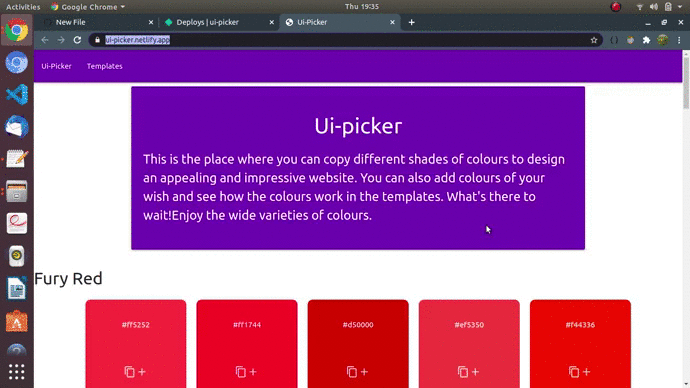

# ui-picker
Ui-picker is a website built using Vanilla-JS which helps to pick colours for the website to enrich the user-interface.
It also has template where you can change the colours of the components.

